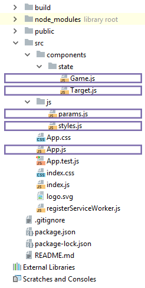

## Описание игры

Игра простая - на экране будут появляться мишени, в них нужно быстро попадать. 

Новые мишени появляются все быстрее, сложность непрерывно возрастает. 

Если в мишень сразу не попасть, то произойдут три вещи: 
+ мишень изменит цвет
+ станет несбиваемой
+ у игрока спишется попытка 

Игра закончится, когда игрок израсходует все попытки.

Готовое приложение на гитхабе https://github.com/ValeriyDyachenko/target-hunter-game 

В качестве шаблона конфигурации я использовал пакет `create-react-app`.

## Структура проекта



### Компоненты

+ `App.js` - точка входа
+ `components/state/Game.js` - управление игровой логикой
+ `components/state/Target.js` - мишень

### Скрипты

+ `js/params.js` - настройки игры
+ `js/styles.js` - стили игровых элементов
+ `index.css` - стили приложения

### Точка входа (App.js)

```js
import React, { Component } from 'react'
import Game from './components/state/Game'
import './App.css'

class App extends Component {
    render() {
        return <Game />
    }
}
export default App
```

## Мишень (components/state/Target.js)

```js
import React from 'react'
import {makeTargetStyle} from '../../js/styles.js'
import {defaultParams} from "../../js/params";

class Target extends React.Component {

    tooLate = setTimeout(
        () => {
            this.setState({fired: true})
            this.props.targetFired()
        },
        defaultParams.periodForClickMsec
    )

    clearTimeout = () => {
        clearTimeout(this.tooLate)
        return true;
    }

    constructor(props) {
        super(props)
        this.state = {fired: false}
    }

    render() {
        return (
            <div
                onClick={
                    () => {
                        !this.state.fired
                        && this.clearTimeout()
                        && this.props.clickHandler(this.props.id)
                    }
                }
                style={ makeTargetStyle({...this.props.coordinate, fired: this.state.fired}) }
            />
        )
    }
}
    
export default Target
```

Игровые настройки хранятся в файле `params.js`, он подключается в импорте. После появления мишени у игрока есть `defaultParams.periodForClickMsec` времени на клик. Потом кликать бесполезно. Это контролирует стандартная *js* функция `setTimeout()`.

Когда `setTimeout()` сработает случится 3 вещи:

+ состояние мишени меняется на `{fired: true}`
+ клики по ней перестанут засчитываться
+ функция попросит приложение списать попытку

Если вовремя не остановить таймер, произойдет сценарий из абзаца выше. Как только игрок попал по мишени нужно очистить таймер. А затем сообщить приложению `id` мишени, чтобы оно знало какую мишень следует удалить с игрового поля.

## Стли элементов (js/styles.js)

```js
import {defaultParams} from './params'

export const gameField = {
    width: defaultParams.fieldWidth + 'px',
    height: defaultParams.fieldHeight + 'px',
    backgroundColor: defaultParams.fieldColor,
    cursor: 'crosshair',
    position: 'relative',
}

export const panelStyle = {
    textAlign: 'center',
    fontSize: '30px',
    color: '#000',
    backgroundColor: defaultParams.fieldColor,
    paddingTop: '40px',
    paddingBottom: '30px',
    marginTop: '60px',
}

export const messageStyle = {
    textAlign: 'center',
    fontSize: '83px',
    paddingTop: '165px',
}

export const makeTargetStyle = ({xpos, ypos, fired}) => {
    return {
        width: defaultParams.targetWidth,
        height: defaultParams.targetHeight,
        backgroundColor: fired ? defaultParams.targetColor2 : defaultParams.targetColor1,
        boxShadow: fired ? defaultParams.targetShadow2 : defaultParams.targetShadow1,
        borderRadius: defaultParams.targetBorderRadius1,
        position: 'absolute',
        top: ypos,
        left: xpos,
    }
}
```

Метод `makeTargetStyle()` ключевой, он рисует мишень с заданными координатами и меняет цвет просроченных мишеней.

## Настройки игры (js/params.js)

```js
export const defaultParams = {
    fieldWidth: 1200,
    fieldHeight: 680,
    targetWidth: 90,
    targetHeight: 90,
    fieldColor: '#fff',
    targetColor1: '#df9e51',
    targetColor2: '#bf3a36',
    targetShadow1: '0px 0px 22px 2px #845216',
    targetShadow2: '0px 0px 22px 2px #730c0c',
    targetBorderRadius1: '100%',
    probability: 50,
    periodMsec: 650,
    periodForClickMsec: 950,
    difficultStepMsec: 7,
    difficultStepProbability: 4,
    difficultIntervalMsec: 1200,
    lifes: 4, //from 0
}

export const initialGameState = () => ({
    targets: [],
    probability: defaultParams.probability,
    life: defaultParams.lifes + 1,
    score:0
})
```

За логику отвечают параметры:

+ `probability` - вероятность появления мишени в периоде `periodMsec`
+ `periodMsec` - период в миллисекундах. В течении этого периода с вероятностью `probability` появится новая мишень
+ `periodForClickMsec` - время на клик по мишени
+ `difficultStepMsec` - шаг уменьшения параметра `periodMsec`, чтобы мишени появлялись быстрее.
+ `difficultStepProbability` - шаг увеличения параметра `probability`, чтобы мишени появлялись чаще
+ `difficultIntervalMsec` - период, через который будут применяться `difficultStepMsec` и `difficultStepProbability`
+ `lifes` - количество попыток

Остальные параметры определяют внешний вид игровых элементов.

Константа `initialGameState` хранит начальное состояние игры.

## Игра (components/state/Game.js)

```js 
import React, { Component } from 'react'
import Target from './Target'
import {defaultParams, initialGameState} from '../../js/params.js'
import {gameField, panelStyle, messageStyle} from '../../js/styles.js'

let gameParams = {...defaultParams}

class Game extends React.Component {

    runNewGame = () => {
        this.setState({ ...initialGameState(), gameover: false, start: true, targetsCnt: 0})
        this.makeGameFlow(this.gameOptions())
    }

    gameOptions = () => ({
        probability: this.state.probability,
        periodMsec: gameParams.periodMsec,
    })

    makeGameFlow = (options) => {
        if (this.state.life === 0) {
            gameParams = {...defaultParams}
            const score = this.state.score
            this.setState({...initialGameState(), gameover: true, lastscore: this.state.score})
            return false
        }
        let gameIterator = this.targetGenerate(options)
        setTimeout(
            () => {
                clearInterval(gameIterator)
                options.periodMsec -= gameParams.difficultStepMsec
                options.probability += gameParams.difficultStepProbability
                this.makeGameFlow(options, this)
            },
            gameParams.difficultIntervalMsec
        )
    }

    targetGenerate = ({probability, periodMsec}) => {
        return setInterval(() => {
            if (Math.random() * 100 <= probability) {
                const xpos = Math.random() * (gameParams.fieldWidth - gameParams.targetWidth)
                const ypos = Math.random() * (gameParams.fieldHeight - gameParams.targetHeight)
                this.setState({
                    targets: [
                        ...this.state.targets,
                        <Target
                            id = {this.state.targetsCnt}
                            key = {this.state.targetsCnt}
                            coordinate = {{xpos, ypos}}
                            clickHandler = {this.clickTarget}
                            targetFired = {this.targetFired}
                        />
                    ],
                    targetsCnt: ++this.state.targetsCnt
                })
            }
        }, periodMsec)
    }

    clickTarget = (id) => {
        console.log(id)
        const _targets = [...this.state.targets]
        _targets.reduce(
            (acc, curr, i, arr) => {
                if (curr.props.id === id) {
                    arr.splice(i, 1)
                    this.setState({
                        score: ++this.state.score,
                        targets: _targets
                    })
                }
            },
            _targets[0]
        )
    }

    targetFired = () => {
        const life = this.state.life > 0
            ? this.state.life - 1
            : 0
        this.setState({life: life})
    }

    constructor(props) {
        super(props)
        this.state = {...initialGameState(), start: false}
    }

    render() {
        return (
            <div>
                <div style={panelStyle}>
                    {   this.state.gameover !== true
                        && this.state.start === true
                        && `Попыток осталось: ${this.state.life} Попаданий: ${this.state.score}`
                    }
                </div>
                <div className="game-field" style={gameField}>

                    {
                        this.state.start === false
                        &&  <div
                                style={messageStyle}
                                onClick={() => this.runNewGame()}
                            >
                                <span style={{cursor: 'pointer'}}>Начать новую игру</span>
                            </div>
                    }

                    {
                        this.state.gameover === true
                        &&  <div style={messageStyle}>
                                <div>Мишеней сбито: {this.state.lastscore}</div>
                                <div onClick={() => this.runNewGame()}>
                                    <span style={{textDecoration: 'underline', cursor: 'pointer'}}>
                                        Играть еще
                                    </span>
                                </div>
                            </div>
                    }

                    { this.state.targets }

                </div>
            </div>
        )
    }
}

export default Game 
```

`runNewGame` начинает новую игру. Он обнуляет игровое состояние и запускает `makeGameFlow`.

`MakeGameFlow` генерирует мишени с помощью `targetGenerate` и останавливает игру, когда попытки кончаются. Это рекурсивная функция, котрая периодически перезапускает сама себя, чтобы игра продолжалась с повышенными параметрами сложности.

`TargetGenerate` добавляет в игру новые мишени. При добавлении учитывается периодичность и вероятность появления мишеней. А так же ведется общий подсчет мишеней, чтобы присваивать новым мишеням уникальные номера.

`ClickTarget` это коллбек. Он нужен для удаления отстреленных мишеней и учета игровых очков. Обратите внимание на функцию `reduce`. Четвертый аргумент функции `reduce` - исходный массив, если его модифицировать, то дальнейшая итерация останавливается.

`ЕargetFired` - коллбек, который запускается, если по мишени не попали за отведенное время. Он уменьшает количество попыток.

Конструктор определяет начальное состояние.

Рендер компонента выводит мишени и статистику. Когда попытки кончаются параметры игры сбрасываются и игрок может начать новую игру.

## Стиль приложения (index.css)

```css
body {
    margin: 0;
    padding: 0;
    font-family: sans-serif;
    background-color: #eeeeee;
}
  
#root {
    min-height: 100vh;
    min-width: 100vw;
    display: flex;
    justify-content: center;
}
```

## Репозиторий

Репозиторий игры https://github.com/ValeriyDyachenko/target-hunter-game.